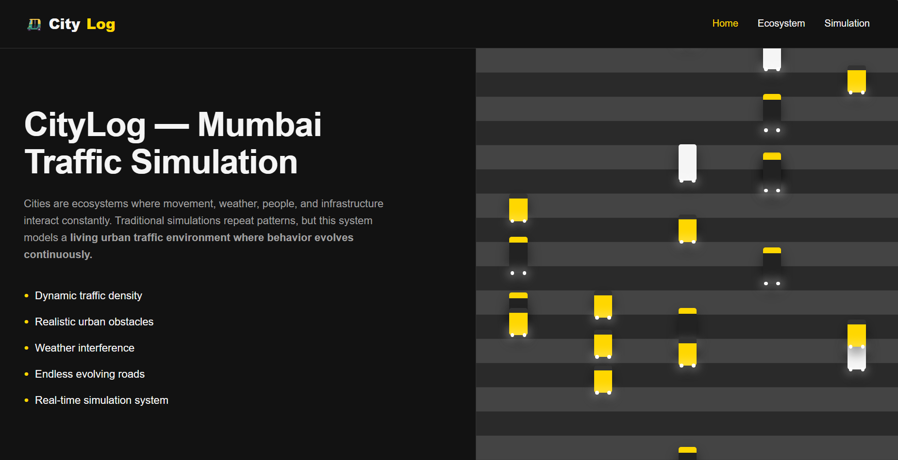
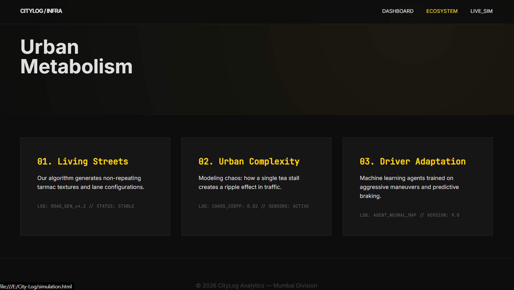

# 🚖 CityLog: Mumbai Traffic Simulation & Rain Rush

## Project Description
CityLog is an interactive, web-based ecosystem designed to model and visualize the unique, highly complex traffic dynamics of Mumbai. Rather than relying on traditional, rigid traffic simulations, CityLog explores **“urban metabolism”**—how weather, infrastructure, localized bottlenecks (like a tea stall), and aggressive driver adaptations create a living, breathing road network.

The project features theoretical deep-dives into urban complexity, live canvas-based network simulations, and culminates in **Mumbai Rain Rush**, a fully playable, high-octane **2D arcade game built entirely in HTML5 Canvas**.

In the game, players pilot an **auto-rickshaw through endless, procedurally generated monsoon traffic**, managing fuel, dodging erratic vehicles, and surviving **“Monsoon Madness.”**

---

# ✨ Features

### Interactive Dashboard
- Sleek **dark-mode UI**
- CSS-driven traffic animations
- Continuous **data ticker**

### Theoretical Data Modules
Analytical breakdowns of:
- Procedural **tarmac generation**
- The **Tapri Ripple Effect** (chaos coefficient of street vendors)
- **Neural driver adaptation models**

### Live Traffic Simulation
Dual-canvas visualization rendering:
- A **pulsing network topology**
- An **endless highway traffic stream**

### Mumbai Rain Rush (Playable Game)

**Custom Physics & Game Loop**
- Smooth movement
- Acceleration
- Lane-changing
- Collision detection

**Dynamic Weather & Particles**
- Rain drops
- Puddle splashes
- Engine exhaust
- Collision sparks
- Lightning flashes

**Procedural Web Audio**
- Custom sound synthesis (no external audio files)
- Engine revs
- Crash noises
- Thunder
- Coin collection chimes
- Built using the **Web Audio API**

**Progressive Difficulty**
- Speed scales with distance
- **“Monsoon Madness” mode at 3000m**

**Responsive Controls**
- Keyboard (WASD / Arrow Keys)
- Touch controls for mobile

---

# 📁 Project Structure

```
├── assets/                 # Folder containing screenshots and game assets
├── index.html              # Main dashboard and entry point with CSS animations
├── ecosystem.html          # Hub for theoretical modules and project navigation
├── living-streets.html     # Deep-dive module: Procedural Tarmac Synthesis
├── urban-complexity.html   # Deep-dive module: The Tapri Ripple Effect
├── driver-adaptation.html  # Deep-dive module: Neural Driver Adaptation
├── simulation.html         # Live dual-canvas network and highway visualization
└── game.html               # "Mumbai Rain Rush" full HTML5 Canvas game
```

---

# 🛠 Technologies Used

### Frontend Structure
- HTML5

### Styling
- CSS3  
- Custom Properties  
- Grid & Flexbox  
- Keyframe Animations  
- Backdrop Filters  

### Programming
- Vanilla JavaScript (ES6+)

### Graphics & Rendering
- HTML5 `<canvas>` API (2D Context)

### Audio
- Web Audio API  
- `AudioContext`
- `OscillatorNode`
- `GainNode`

### Fonts
- Google Fonts  
- **Inter**
- **JetBrains Mono**

### Dependencies
- **None**  
The project is completely standalone.

---

# ⚙️ How the Code Works

The application is divided into **static informative interfaces** and **dynamic canvas-driven simulations**.

---

## 1. UI and Routing  
`index.html`, `ecosystem.html`, and module pages

These files use **modern CSS layouts** (Grid + Flexbox) to create a futuristic **data-dashboard aesthetic**.

Routing is handled through **standard hyperlink navigation**.

The dashboard includes:
- A **custom CSS animation (`@keyframes ticker`)**
- A **lightweight JavaScript script** that spawns and animates HTML-based vehicles.

---

## 2. Live Simulation  
`simulation.html`

Uses **two layered canvas elements**.

### Node Canvas
- Generates a **randomized graph network**
- Nodes pulse using `Math.sin`
- Lines connect nearby nodes to simulate **data flow or road networks**

### Highway Canvas
Runs a `requestAnimationFrame` loop to:
- Animate **dashed road lines**
- Move text-based vehicle entities vertically

---

## 3. Game Engine  
`game.html`

The game is built **entirely from scratch without any game engine**.

### Game Loop
Uses `requestAnimationFrame` to run:

- `update()`
- `draw()`

A **delta time (`dt`) calculation** ensures frame-rate-independent movement.

---

### State Management
Handles transitions between:
- Start
- Playing
- Paused
- Game Over

---

### Entity Management

Arrays store:
- Obstacles
- Particles
- Collectibles

The update loop:
- Applies velocity
- Updates positions
- Removes off-screen entities

---

### Collision Detection

Uses **Axis-Aligned Bounding Box (AABB)** detection to check intersections between:

- Player auto-rickshaw
- Generated obstacles

---

### Procedural Audio

The game dynamically generates sound:

- **Thunder / crashes:** random noise buffers
- **Engine / coin sounds:** oscillators with mapped frequencies
- **Volume control:** exponential gain envelopes

---

# 💻 Installation Instructions

No build tools or package managers are required.

### 1. Clone the repository

```
git clone https://github.com/puru2456/City-Log-Mumbai-Traffic-Simulation.git
```

### 2. Navigate to the folder

```
cd citylog-simulation
```

### 3. Launch the project

Simply open:

```
index.html
```

in your browser.

**Note:**  
For audio synthesis to work, most browsers require **a user interaction (click)** before the Web Audio API activates.

If using VS Code, install the **Live Server extension**.

---

# 🚀 Deployment Instructions

Since the project contains **only static files**, deployment is very easy.

---

## Using GitHub Pages

### 1. Create a repository on GitHub

### 2. Run these commands in Git Bash

```
git init
git add .
git commit -m "Finalizing CityLog Mumbai"
git branch -M main
git remote add origin https://github.com/yourusername/citylog-simulation.git
git push -u origin main
```

### 3. Enable GitHub Pages

Go to:

```
Repository → Settings → Pages
```

Select:

```
Branch: main
Folder: / (root)
```

Click **Save**.

---

## Alternative Deployment

You can also deploy instantly using:

- Netlify
- Vercel

Simply **drag and drop the project folder**.

---

# 🎮 Usage

### Exploring
Start at:

```
index.html
```

Use the **top navigation bar** to explore the ecosystem modules.

---

### Simulation

Visit **Live Sim** to view the **abstract network topology**.

---

### Playing the Game

From the **Live Sim page**, click:

```
INITIATE_MANUAL_CONTROL
```

---

## Game Controls

| Action | Controls |
|------|------|
| Steer | Arrow Keys / A / D |
| Boost | Up Arrow / W |
| Brake | Down Arrow / S |
| Pause | P or Esc |
| Mute | M |

Mobile players can **swipe left or right**.

Goal:
- Collect **coins**
- Collect **fuel cans**
- Dodge traffic
- Survive as long as possible.

---

# 📸 Screenshots / Demo

## 📸 Screenshots

### Dashboard


### Driver Adaptation


### Ecosystem


### Game Module


### Live Simulation


### Living Streets


### Urban Complexity

# 🔮 Future Improvements

- Global **leaderboard backend** (Node.js / Firebase)
- Improved **mobile touch controls**
- Additional obstacles
  - Potholes
  - Pedestrians
  - Flooded roads
- **Dynamic day/night cycle**
- Automatic **vehicle headlights**

---

# 🧰 Troubleshooting

### No Sound
Click anywhere on the screen to activate the **Web Audio API**.

### Laggy Performance
Enable **Hardware Acceleration** in browser settings.

### Mobile Issues
Play in **landscape mode** for better lane visibility.

---

# 👨‍💻 Author

**[Your Name]**

---

# 📜 License

This project is licensed under the **MIT License**.  
See the `LICENSE` file for details.
